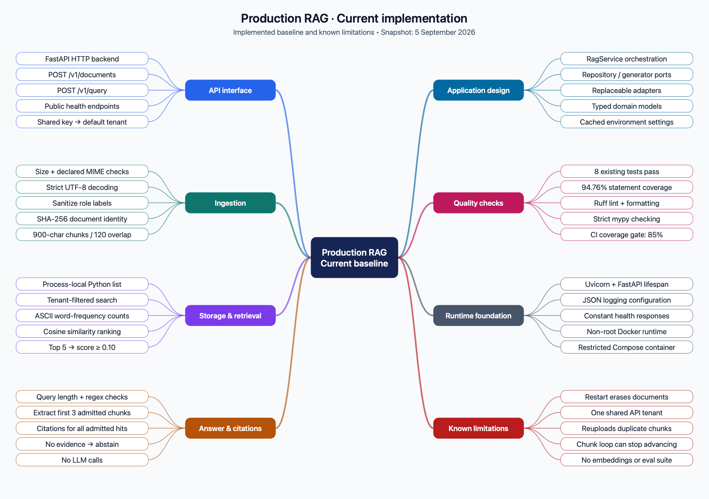
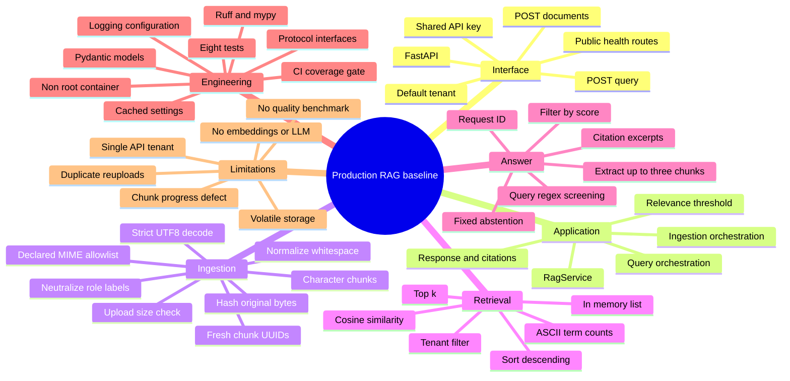
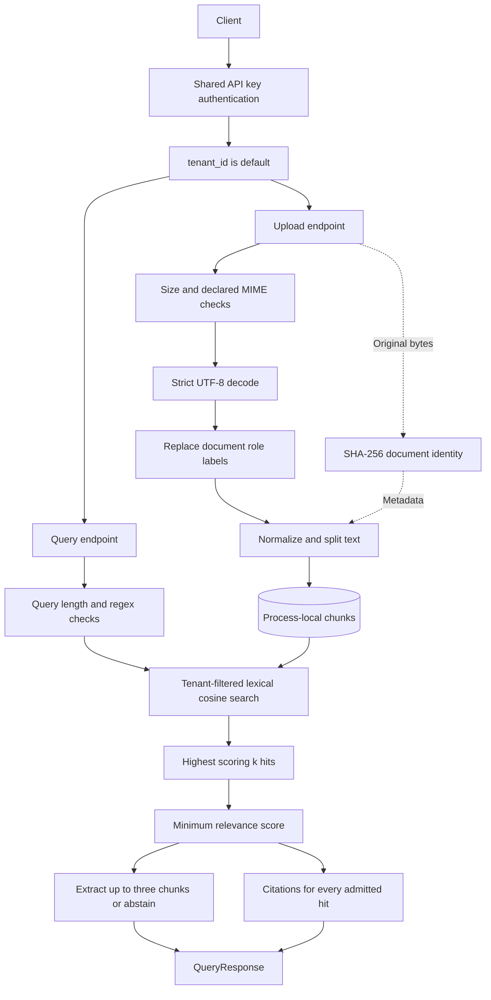
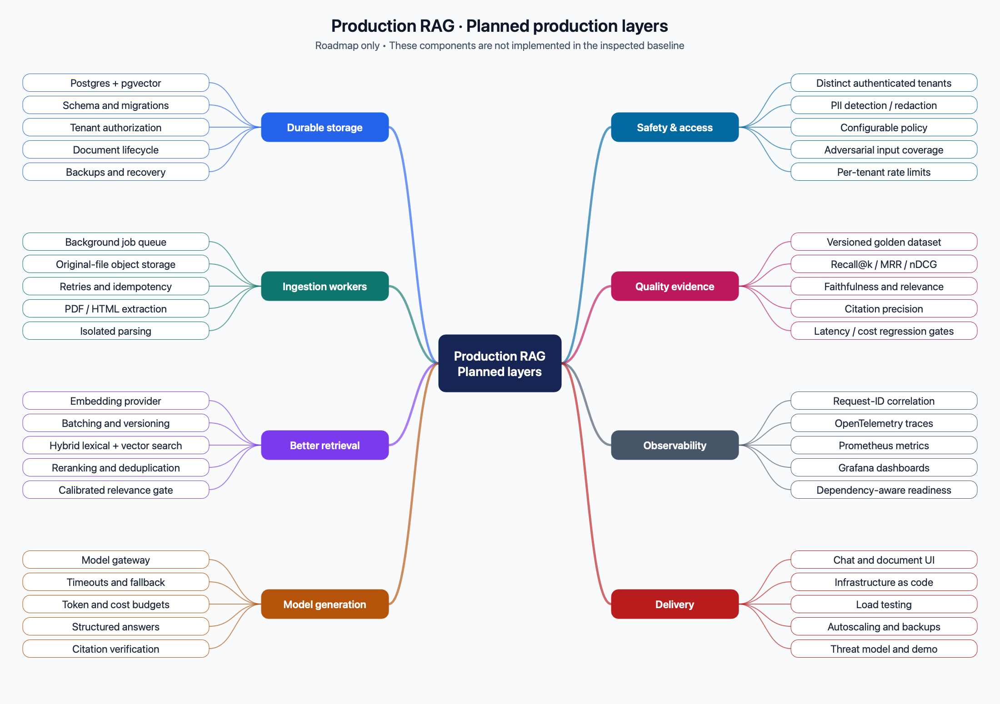
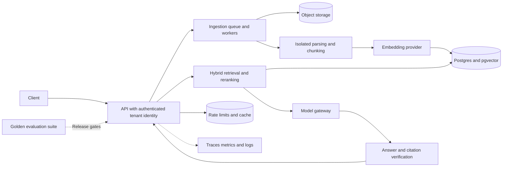

# System mind map

[Guide home](README.md) · Next: [Architecture and code atlas](02-architecture-and-code.md)

## Current implementation



[Open full-size PNG](assets/current-system-mind-map.png) · [Open scalable SVG](assets/current-system-mind-map.svg)

<details>
<summary>Editable Mermaid source</summary>



</details>

<details>
<summary>Plain-text alternative</summary>

```text
Production RAG — current baseline
├── Client interface
│   ├── /docs and /openapi.json: interactive docs and schema
│   ├── /health/live and /health/ready: public constant responses
│   ├── POST /v1/documents: multipart text upload
│   └── POST /v1/query: JSON question
├── Request boundary
│   ├── x-api-key compared with configured API_KEY
│   ├── Successful authentication → tenant_id = "default"
│   ├── Upload: size + declared MIME type + UTF-8 checks
│   └── Query: schema + stripped length + regex screening
├── RagService
│   ├── ingest
│   │   ├── Sanitize document role labels
│   │   ├── SHA-256 original bytes → document ID
│   │   ├── TextChunker → text pieces
│   │   └── ChunkRepository.add → process-local list
│   └── query
│       ├── ChunkRepository.search → tenant-filtered lexical top-k
│       ├── Keep hits scoring at least MIN_RELEVANCE_SCORE
│       ├── Generator.generate → up to three source texts or abstention
│       └── QueryResponse → answer, citations, request_id, grounded
├── Replaceable contracts
│   ├── ChunkRepository → InMemoryChunkRepository
│   └── Generator → ExtractiveGenerator
├── Supporting engineering
│   ├── Settings from environment/.env
│   ├── JSON log formatting and generic 500 response
│   ├── pytest + coverage + Ruff + mypy
│   └── Dockerfile + Compose + GitHub Actions workflow
└── Planned production layers, not running today
    ├── Persistent tenant-authorized database and migrations
    ├── Embeddings, hybrid retrieval, reranking
    ├── Queued ingestion, object storage, richer parsers
    ├── Model gateway, answer verification, stronger safety
    └── Evaluations, telemetry, rate limits, deployment and backups
```

</details>

## Current data flow



The memory store is shared by upload and query requests handled by the same application instance. It is not shared across independent workers or replicas. There is no external database hidden behind the store.

## Target architecture: planned only



[Open full-size PNG](assets/planned-system-mind-map.png) · [Open scalable SVG](assets/planned-system-mind-map.svg)



This is a direction derived from the roadmap, not a description of deployed services. The repository does not yet define those components or their detailed orchestration.
