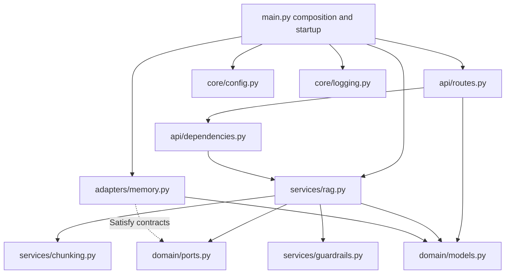

# Architecture and code atlas

[Guide home](README.md) · Previous: [Mind map](01-mind-map.md) · Next: [Pipeline walkthrough](03-pipeline-walkthrough.md)

## Why the code is separated this way

The HTTP layer should know how to accept an upload and return a response. The application service should know the ingestion/query sequence. Storage and answer generation should be replaceable without rewriting those sequences. The repository implements this separation through Python protocols and constructor injection.



A `Protocol` describes method signatures without requiring inheritance. `RagService` accepts an object satisfying `ChunkRepository` and one satisfying `Generator`; the startup function selects the concrete implementations. Type checking helps catch incompatible implementations, but the protocols do not themselves enforce persistence, authorization, or runtime failure policy.

## Startup, step by step

1. Uvicorn imports `rag_api.main:app`.
2. `main.py` creates the FastAPI application, includes the router, and registers the generic exception handler.
3. FastAPI enters the `lifespan` async context manager.
4. `get_settings()` constructs and caches `Settings`, loading `.env` and environment values.
5. `configure_logging()` configures standard logging and structlog processors.
6. A new `InMemoryChunkRepository`, `ExtractiveGenerator`, `TextChunker`, and `InputGuardrail` are constructed.
7. These objects and the configured query/retrieval limits are passed to `RagService`.
8. The service is stored at `app.state.rag_service` for request dependencies to retrieve.
9. `yield` hands control to the running application. There is no resource cleanup after it because the current adapters have no external connections to close.

Each application lifespan creates a new empty repository. A process restart removes the corpus. Multiple workers create independent corpora. Declaring methods `async` does not turn the local Python tokenization, sorting, and chunking into background work.

## Every application source file

Paths below are relative to the repository root; links open the implementation.

| File | Responsibility and important details |
| --- | --- |
| [`src/rag_api/main.py`](../../src/rag_api/main.py) | Composition root, lifespan, FastAPI app, generic 500 handler, CLI `run()` |
| [`src/rag_api/api/routes.py`](../../src/rag_api/api/routes.py) | Four routes; reads upload limit + 1 bytes, checks MIME, maps selected exceptions to HTTP responses |
| [`src/rag_api/api/dependencies.py`](../../src/rag_api/api/dependencies.py) | Retrieves the service from app state; checks `x-api-key`; returns literal tenant `default` |
| [`src/rag_api/core/config.py`](../../src/rag_api/core/config.py) | Pydantic settings, value bounds, `.env` support, cached settings factory |
| [`src/rag_api/core/logging.py`](../../src/rag_api/core/logging.py) | Context-variable merge, log level, ISO timestamp, JSON rendering |
| [`src/rag_api/domain/models.py`](../../src/rag_api/domain/models.py) | Internal immutable dataclasses and Pydantic API schemas |
| [`src/rag_api/domain/ports.py`](../../src/rag_api/domain/ports.py) | Repository and generator protocols |
| [`src/rag_api/services/rag.py`](../../src/rag_api/services/rag.py) | Ingestion/query orchestration, hashing, relevance filtering, citations, request IDs |
| [`src/rag_api/services/chunking.py`](../../src/rag_api/services/chunking.py) | Whitespace normalization and overlapping character windows |
| [`src/rag_api/services/guardrails.py`](../../src/rag_api/services/guardrails.py) | Query policy checks and document role-label replacement |
| [`src/rag_api/adapters/memory.py`](../../src/rag_api/adapters/memory.py) | ASCII token counts, cosine calculation, local repository, extractive generator |
| [`src/rag_api/__init__.py`](../../src/rag_api/__init__.py) | Package docstring |
| [`src/rag_api/py.typed`](../../src/rag_api/py.typed) | Marker advertising package typing information |

## Domain data structures

### `Chunk`: the storage unit

`Chunk` is a frozen, slotted dataclass. “Frozen” prevents ordinary field assignment after construction; “slotted” avoids a normal per-instance attribute dictionary.

| Field | Type | Where it comes from |
| --- | --- | --- |
| `text` | `str` | One sanitized and normalized text piece |
| `document_id` | `str` | First 24 hex characters of the original-byte SHA-256 digest |
| `index` | `int` | Zero-based position within that upload's chunks |
| `tenant_id` | `str` | Service argument; `default` through the current API |
| `source` | `str` | Client filename or fallback `document.txt` |
| `id` | `str` | Fresh UUID4 per constructed chunk |
| `created_at` | `datetime` | UTC timestamp at chunk construction |

There is no separate stored document record, original-file archive, page number, character offset, embedding, or parser version. `source` is a filename label, not a download link. Normalization means chunk text is not necessarily byte-for-byte original content.

### `SearchHit`: one ranked candidate

`SearchHit` contains a `Chunk` and a floating-point `score`. The repository returns a list of these objects, ordered by descending cosine similarity. This is an internal structure, not the query response schema.

### Public Pydantic schemas

| Model | Fields | Meaning |
| --- | --- | --- |
| `QueryRequest` | `question: str`, minimum length 1 | HTTP JSON input; the configured maximum is checked later by the service |
| `IngestResponse` | `document_id`, `chunks_created`, `content_sha256` | Identity and chunk count for this ingestion call |
| `Citation` | `document_id`, `source`, `chunk_index`, `score`, `excerpt` | Provenance for one threshold-passing hit |
| `QueryResponse` | `answer`, `citations`, `request_id`, `grounded` | Answer payload and evidence metadata |

`chunks_created` counts generated pieces; it is not a durable insert count acknowledged by a database. `grounded` is `bool(grounded_hits)`. Neither Pydantic nor this boolean verifies that a claim is entailed by its citations.

## Replaceable interfaces

```python
class ChunkRepository(Protocol):
    async def add(self, chunks: list[Chunk]) -> None: ...
    async def search(self, query: str, tenant_id: str, limit: int) -> list[SearchHit]: ...

class Generator(Protocol):
    async def generate(self, question: str, context: list[SearchHit]) -> str: ...
```

A future database adapter would implement the two repository methods, preserve tenant boundaries, and translate database results into `SearchHit` objects. A future model adapter would accept the question/context and return an answer string. `main.py` would wire them in.

The existing interfaces are intentionally small. They do not yet represent deletion, metadata filters, ingestion job status, streaming, token usage, retry policies, or a structured model result. Adding these capabilities may require evolving the contracts. Replacing cosine retrieval also requires recalibrating the relevance threshold: different retrieval systems have different score semantics.

## Other repository files

| File or directory | What it provides |
| --- | --- |
| [`pyproject.toml`](../../pyproject.toml) | Package metadata, Python requirement, dependencies, tool settings, CLI entry point |
| [`uv.lock`](../../uv.lock) | Resolved dependency versions for uv; CI uses frozen synchronization |
| [`.env.example`](../../.env.example) | Public development configuration; commented future provider hints |
| `.env` | Local settings; ignored by Git and not reproduced in this guide |
| [`.gitignore`](../../.gitignore) | Excludes local secrets file, virtualenv, caches, coverage/build artifacts |
| [`Makefile`](../../Makefile) | Install/run/lint/typecheck/test/check commands |
| [`Dockerfile`](../../Dockerfile) | Python 3.12 slim image, package installation, UID 10001 runtime user |
| [`compose.yaml`](../../compose.yaml) | One API service, port 8000, restricted runtime, liveness healthcheck |
| [`.github/workflows/ci.yml`](../../.github/workflows/ci.yml) | Python 3.12 lint, formatting, typing, tests and 85% coverage gate |
| [`tests/`](../../tests) | Eight tests across API, chunking, and guardrails |
| `evals/datasets/` | Empty directory at inspection; no benchmark data |
| `scripts/` | Empty directory at inspection; no automation scripts |
| [`ROADMAP.md`](../../ROADMAP.md) | Future milestones |
| [`docs/architecture.md`](../architecture.md) | Original short architecture overview, linked to this detailed guide |

Runtime dependencies are FastAPI, HTTPX, pydantic-settings, python-multipart, structlog, and Uvicorn with standard extras. HTTPX is used by the test client path; no outbound provider call exists in the application. Development extras include mypy, pre-commit, pytest, pytest-asyncio, pytest-cov, and Ruff. A pre-commit dependency is present, but no `.pre-commit-config.yaml` is checked in. The build backend is Hatchling, and the `rag-api` console entry point calls `rag_api.main:run`.
